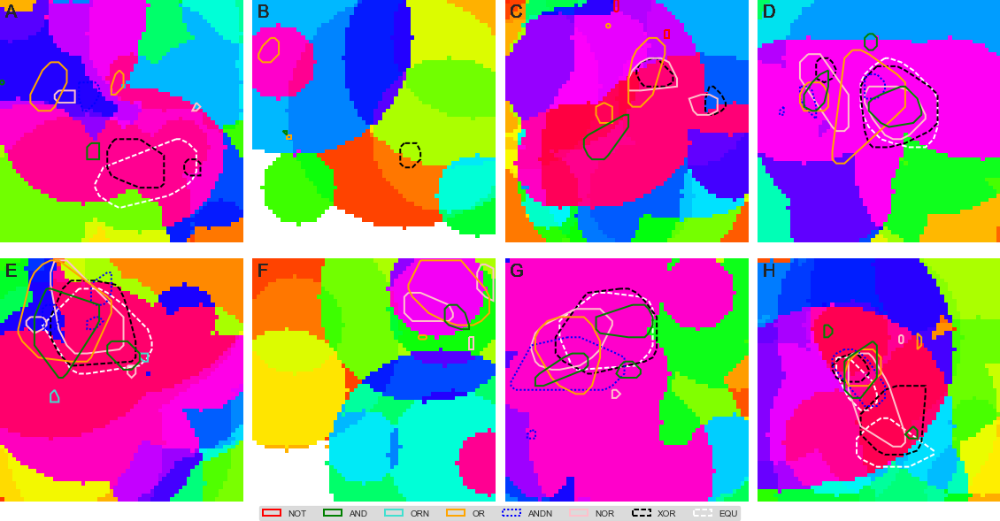

This repository contains figures, scripts, and data for the paper:

# Spatial resource heterogeneity creates local hotspots of evolutionary potential
By Emily Dolson and Charles Ofria
(submitted to the European Conference on Artificial Life, 2017)

## Contents:
- *hotspots.tex* -  LaTeX file for main paper
- *alifeconf.sty* - Style file for ECAL
- *Zotero.bib* - bibliography file for paper
- *config* - contains all files used to generate daa
  - *avida* - executable used to generate data
  - *avida-lineage* - executable used to output lineage trajectories
  - *avida.cfg* - config file for Avida (not changed from default)
  - *defaults-heads.org* - starting organism (not changed from default)
  - *env500XX.cfg* - these files indicate how to build the 8 different environments
  - *envcontrol.cfg* - file to specify the homogeneous control environment
  - *events.cfg* - tells Avida what data to output when
  - *corner_events.cfg* - events file that puts starting organism in oppostie corner
  - *instset-heads.cfg* - tells avida what instruction set to use (not changed from default)
  - *lineage_events.cfg* - events file for runs where spatial lineage is being output
  - *write_events_file.py* - python script to make events file that only prints phenotype grid immediately before a new task is going to evolve (assumes that extract_points.py has already been called to determine when each task will evolve)
- *data* - contains summary-level data files extracted from raw data (raw data would be too large too include)
  - *all_task_locs.csv* - the locations where each task first evolved in each run
  - *control_diversity_ranks.csv* - the percentile of the diversity of the cell where each task first evolved in each replicate of the control condition
  - *diversity_ranks.csv* - the percentile of the diversity of the cell where each task first evolved in each replicate of the experimental conditions
  - *qsub_files* - all of the scripts used to submit experiments to MSU's high performance compupting cluster
- *figs* - figures
  - *50060_9_paths.png* - all lineage paths for task 9 in environment 50060 (not very useful - there are too many)
  - *50065_all_hotspots.png* - all hotspots across all environments
  - *9_50013_density.png* - kernel density map for task 9 in environment 50013
  - *9_50013_hotspots.png* - hotspot locations for task 9 in environment 50013
  - *9_50013_k-hat.png* - Ripley's K for task 9 in environment 50013
  - *9_50013_points.png* - point locations for task 9 in environment 50013
  - *control_9_paths.png* - 5 example lineage paths for task 9 for each environment
  - *localdiversity.png* - qqplot comparing diversity ranks to uniform distribution
  - *statsfig.png* - diagram outlining statsitics pipeline
  - *statsfig_horizontal_1col.png* - smaller version of the stats pipeline figure that fits in 1 column
- *scripts* - Python and R scripts for processing and analyzing data
  - *collect_points.py* - grab data from task_locs.csv files for each rep and summarize them into all_task_locs.csv
  - *draw_hotspots.py* - can be used to make various figures showing points, hotspots, and lineage paths over an environment
  - *env500XX.csv* - files generated by extract_env_data.py that indicate distance from each cell in each environment to each resource
  - *envcontrol.csv* - like above, except it's all 0s
  - *extract_diversity.py* - generate diversity_ranks.csv file from raw phenotype grids
  - *extract_env_data.py* - generate csv files indicating the distance from each cell in an environment to each resource
  - *extract_grids.py* - grab phenotype grids from right before each task evolves out of tar archives
  - *extract_paths.csv* - convert sequence of ints output by avida-lineage into actual sequences of coordinates and environments that a lineage passed through
  - *extract_points.csv* - loop through phenotype grids to figure out when each task first appears (generates task_locs.csv)
  - *kriging.R* - R script that handles all of the regression that we used in an attempt to figure out what causes hotspots
  - *make_diversity_maps.csv* - makes heat maps of local diversity for updates immediately before tasks evolved
  - *make_hotspot_figure.py* - variant on draw_hotspots.py, used to make multi-panel hotspot figure in paper
  - *make_path_figure.py* - variant on draw_hotspots.py used to make multipanel path figure in paper
  
